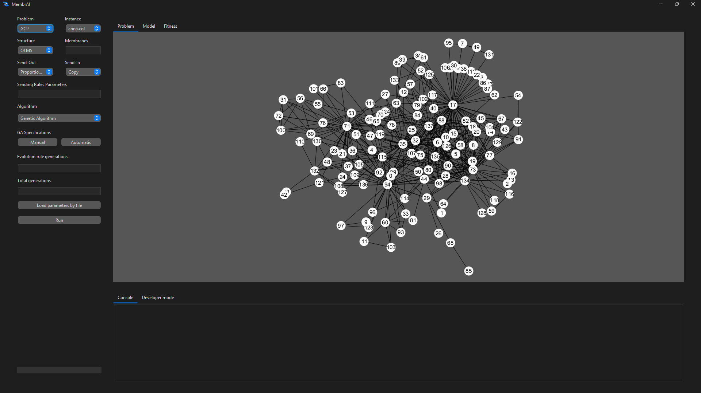
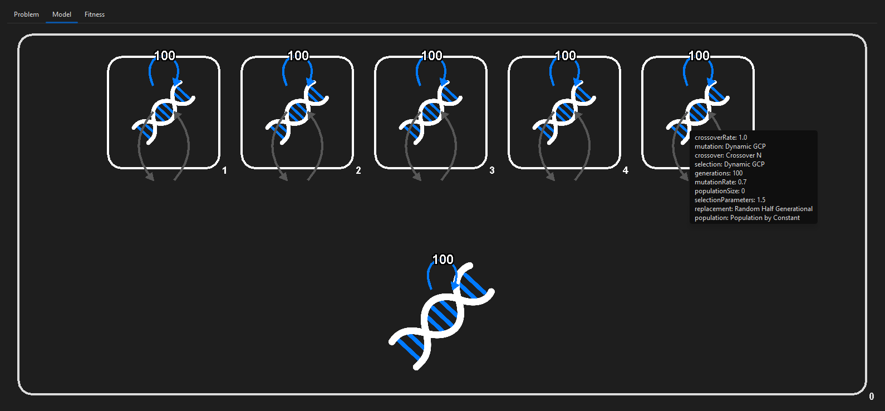
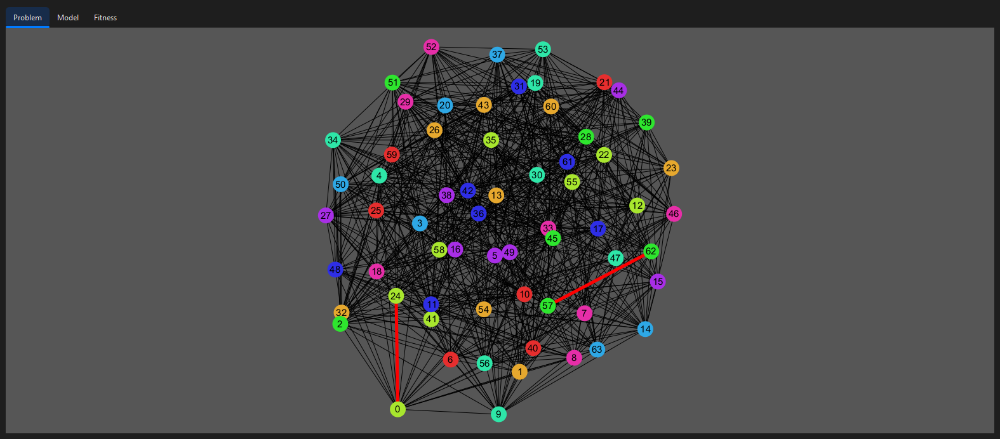
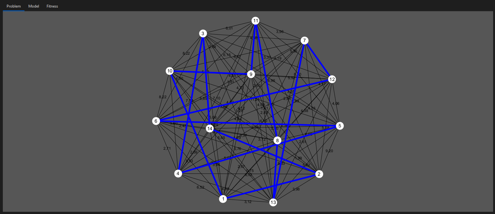
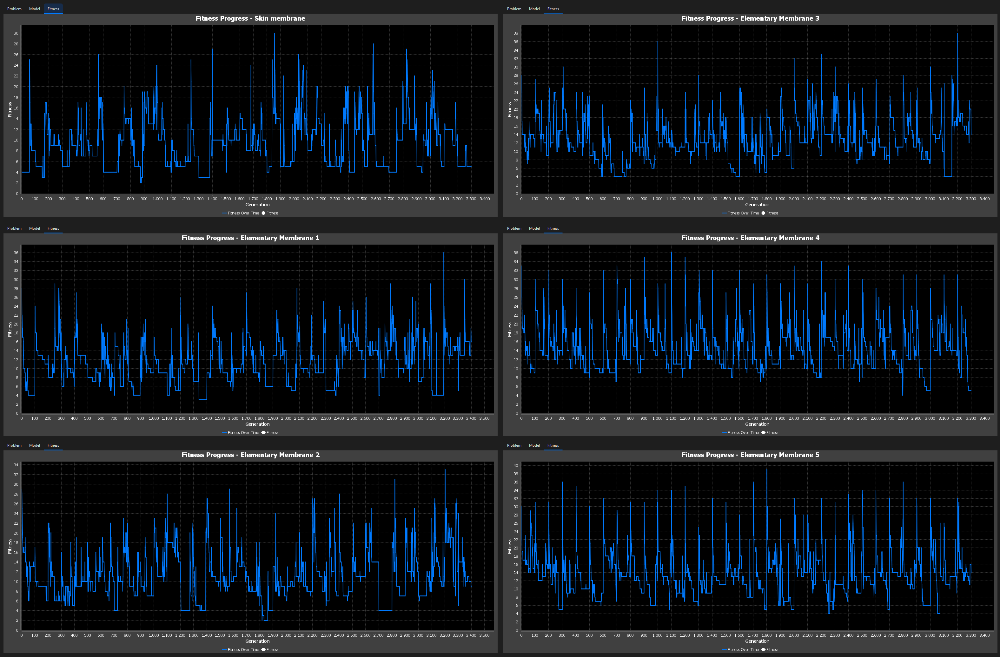
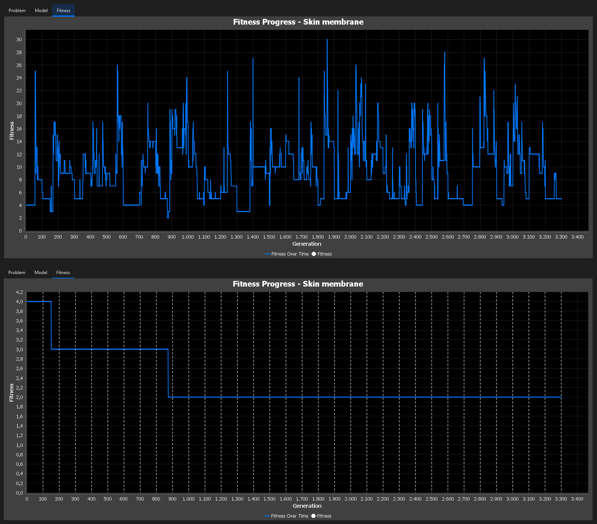
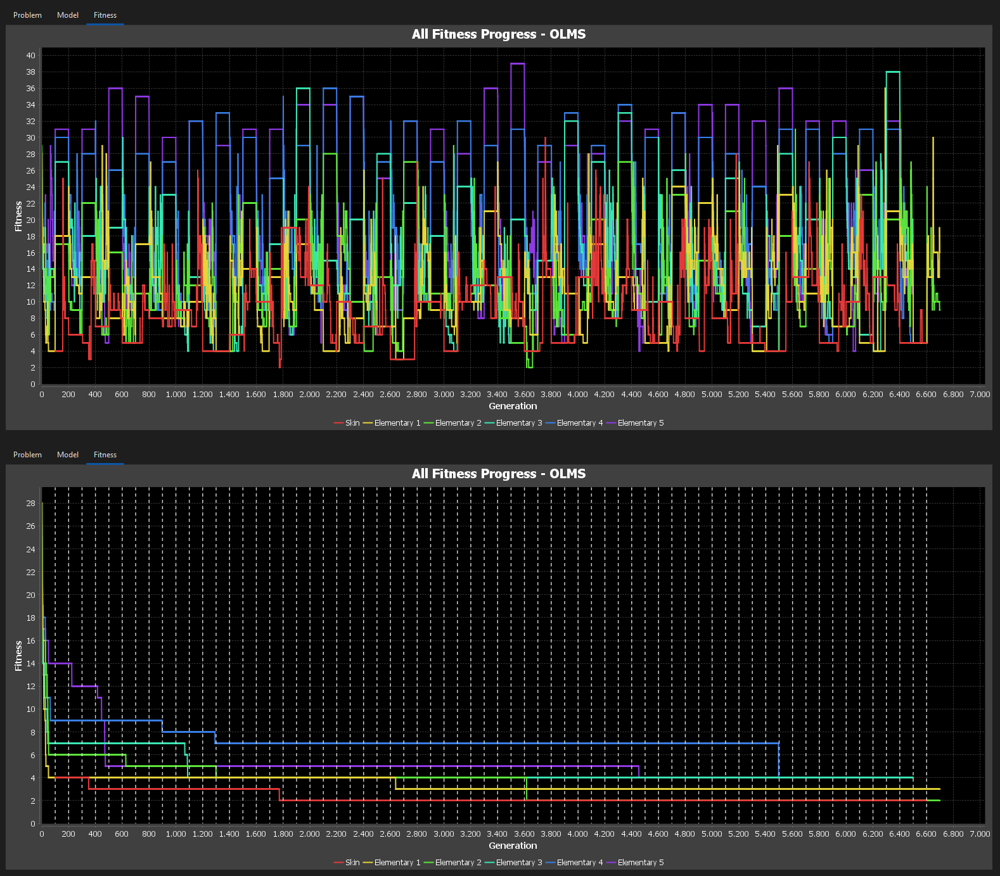

<table>
<tr>
<td width="120">

</td>
<td>

# MembrAI: Membrane Algorithms for NP-Complete Optimization Problems

</td>
</tr>
</table>

MembrAI is a simulation and experimentation framework designed to study **Membrane Algorithms (MAs)** applied to **NP-complete optimization problems**, specifically:

- Graph Coloring Problem (GCP)
- Traveling Salesman Problem (TSP)


Membrane Algorithms are distributed evolutionary models in which multiple populations evolve inside a membrane structure and interact through communication and update rules. This repository was created as part of a research thesis focused on the formalization, implementation, and experimental evaluation of these models.

---
## 🎯 Purpose

This project was developed as part of a research thesis focused on:

> The study of Membrane Algorithms for NP-complete problems using Genetic Algorithms as a metaheuristic.

It aims to:
- Provide a flexible experimental platform
- Analyze cooperation between populations
- Compare different membrane structures and strategies

---

## 🖥️ Features

- Support for **Membrane Algorithm structures**:
  - One-Level Membrane Structure (OLMS)
  - Nested Membrane Structure (NMS)

- Integration of **problem-specific Genetic Algorithms** for:
  - Traveling Salesman Problem (TSP)
  - Graph Coloring Problem (GCP)

- Interactive **graphical user interface (GUI)**:
  - Problem visualization (graphs and tours)
  - Membrane model visualization
  - Fitness evolution plots

- Export of **results**:
  - Fitness evolution per membrane (CSV)
  - Best solution obtained
  - Experiment configuration (JSON)


## ⚙️ Requirements

- Java 17 or higher


## 📦 Installation

No installation is required. Simply download or clone the repository and navigate to the project directory:

```bash
git clone https://github.com/josandguz/MembrAI
cd MembrAI
```
## 📁 Project Structure

```text
MembrAI/
├── MembrAI.jar               # Executable application
├── lib/                      # Required external libraries
├── instances/                # Problem instances
│   ├── gcp/                  # GCP instances
│   └── tsp/                  # TSP instances
├── experiments/              # Predefined experiment configurations
│   ├── case_studies/         # Full Membrane Algorithm experiments (Load parameters by file)
│   └── ga_configs/           # Genetic Algorithm configurations (Automatic)
├── images/                   # Screenshots used in the README
├── README.md
├── LICENSE
└── .gitignore
```


## ▶️ How to Use

### 1. Run the application

Launch the simulator with:

```bash
java -jar MembrAI.jar
```

### 2. Select a problem

Choose one of the supported problems:

- GCP
- TSP

### 3. Select an instance

Choose an available instance directly from the Instance selector in the GUI.

### 4. Configure the experiment

Set the parameters of the Membrane Algorithm and the corresponding Genetic Algorithm through the GUI. You can also inspect the membrane structure in the Model tab before execution.


### 5. Run and analyze the results

Execute the experiment and inspect the resulting solution.

Use the **Fitness** tab to explore the evolution of the algorithm across membranes and generations.

### 6. Save results

Use the **Save results** option to export the results of the experiment for further analysis.

## 🧪 Experiments

MembrAI provides support for predefined experiments to facilitate reproducibility and systematic evaluation.

### Case studies

Complete experiment configurations can be found in:

```
experiments/case_studies/
```

These files do not represent all possible combinations of Membrane Algorithms and Genetic Algorithms. Instead, they provide a selected set of case studies based on the best-performing strategies identified in the study for each membrane structure, along with a Genetic Algorithm configuration that performed well for the corresponding problem.

For both OLMS and NMS, the case studies use a fixed experimental setup with:

- 5 membranes
- 300 generations

These configurations can be loaded directly through the **Load parameters by file** option in the GUI.

### Genetic Algorithm configurations

Predefined Genetic Algorithm configurations are available in:

```
experiments/ga_configs/
```

This folder contains the full set of GA configurations used throughout the study.

These configurations can be loaded through the **Automatic** option in the GUI.

### Additional notes

After loading either a complete case study or a GA configuration, any parameter or operator can still be modified manually through the GUI if further customization is desired.

## 📊 Output and Visualization

After each execution, MembrAI provides visual and exportable information to support the analysis of results.

### Visualization

The GUI allows the user to inspect:

- The best solution obtained for the selected problem
- The membrane structure defined for the experiment
- The fitness evolution of each membrane

The **Fitness** tab provides detailed insight into the algorithm's behavior:

- Navigate between membranes using **Previous** and **Next**
- Enable **Execution Best** to display the best historical fitness found
- Enable **Communication** to visualize when communication steps occur (vertical markers)
- Use **Show All** to display the fitness evolution of all membranes simultaneously

All visualization options are also available in **Show All** mode.

### Exported results

The **Save results** option allows exporting:

- Best chromosome and fitness (TXT)
- Fitness evolution data for each membrane (CSV)
- Experiment configuration (JSON)


## 🖼️ Screenshots

### Main interface

Overview of the simulator, including problem selection, instance selection, and parameter configuration.



### Membrane model visualization

Visualization of the membrane structure defined for the experiment.




### Solutions

Examples of solutions obtained for the supported problems.

#### Graph Coloring Problem (GCP)

Example of a valid coloring where each node is assigned a color such that no adjacent nodes share the same color.



#### Traveling Salesman Problem (TSP)

Example of a tour found by the algorithm, representing a route that visits each node exactly once and returns to the starting point, minimizing the total distance.



### Fitness analysis

MembrAI provides multiple ways to analyze the evolution of the algorithm through the **Fitness** tab.

#### Per-membrane evolution

Fitness evolution can be inspected individually for each membrane.



#### Best execution tracking

The **Execution Best** option highlights the best historical fitness found during execution. When combined with the **Communication** option, vertical markers indicate when communication steps occur.



#### Global view and communication

The **Show All** option displays the evolution of all membranes simultaneously.

The image above shows the standard view, while the image below shows the same visualization with **Execution Best** and **Communication** enabled. In this mode, the best historical fitness is highlighted and vertical markers indicate when communication steps occur.




## 👤 Author

Developed by **José Antonio Andreu Guzmán**  
Email: jandreu@us.es  


## 📜 Usage

This repository provides a compiled version of the software for academic and demonstration purposes.

The source code is not included in this version.

---

